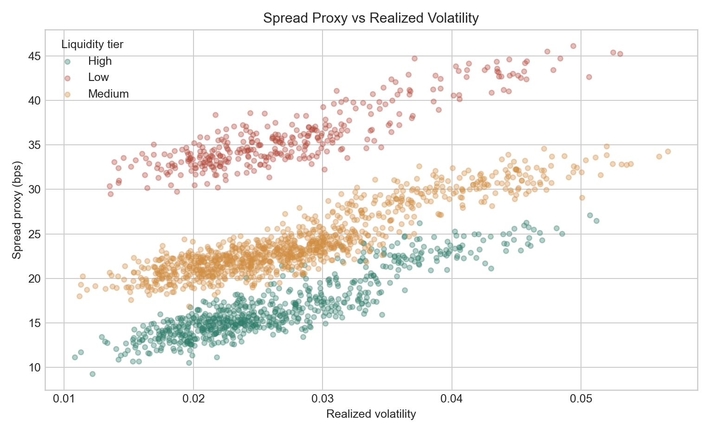
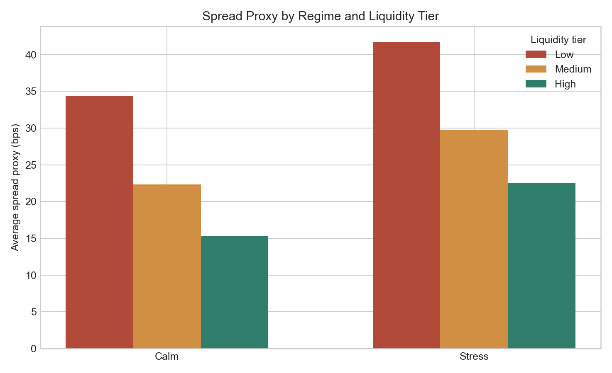

<div align="center">
  <h1>Market Microstructure Study</h1>
  <p><strong>A compact quant research project on how volatility and liquidity affect trading frictions.</strong></p>
  <p>Built with synthetic data to demonstrate research structure, reproducibility, and clear interpretation.</p>
</div>

<p align="center">
  <code>quant research</code>
  <code>market microstructure</code>
  <code>synthetic data</code>
  <code>notebook workflow</code>
  <code>reproducible analysis</code>
</p>

## Portfolio Role

This is the research-focused repo in the portfolio. It complements the product-style projects by showing hypothesis formation, empirical analysis, and concise written findings.

## Research Question

How do volatility and liquidity affect a simple spread proxy?

## Hypothesis

- Higher volatility should be associated with wider spreads.
- Lower liquidity should be associated with wider spreads.
- The widening effect should be strongest during stress regimes.

## Project Structure

- `data/`: generated synthetic dataset
- `figures/`: charts created by the analysis script
- `notebooks/`: notebook-style walkthrough starter
- `results/`: summary tables and key findings
- `src/`: data generation and analysis code

## Quick Start

```bash
python3 -m venv .venv
source .venv/bin/activate
pip install -r requirements.txt
python src/generate_data.py
python src/analysis.py
```

## Methods

The study generates cross-sectional daily data for synthetic instruments across different liquidity tiers and market-cap buckets. It then:

1. simulates returns, volatility, turnover, and spread proxies
2. labels observations into calm versus stress regimes
3. estimates a simple OLS relationship between spread, volatility, and log turnover
4. compares spread behavior across liquidity tiers and stress regimes
5. saves charts and summary outputs for portfolio presentation

## Outputs

After running the scripts, you should see:

- `data/synthetic_microstructure_data.csv`
- `results/summary_metrics.csv`
- `results/regression_summary.csv`
- `results/key_findings.md`
- `figures/spread_vs_volatility.png`
- `figures/spread_by_regime_and_liquidity.png`
- `figures/spread_distribution_by_liquidity.png`

## Preview Charts





## Example Findings From The Synthetic Sample

- Average spread proxy is wider in stress regimes than in calm regimes: `31.35 bps` versus `24.00 bps`
- Low-liquidity names show materially wider spreads than high-liquidity names: `38.07 bps` versus `18.92 bps`
- In the simple OLS, realized volatility loads positively on spread: `+283.17`
- Log turnover loads negatively on spread: `-8.71`
- The stress indicator remains positive even after controlling for volatility and turnover: `+4.55`

## Why This Project Matters

This project is designed to complement a dashboard portfolio piece. Instead of showcasing interface design, it showcases research thinking:

- forming a clear hypothesis
- building a reproducible dataset
- running a simple empirical analysis
- summarizing findings in a compact and readable way

## Screenshot Strategy

- lead with `spread_vs_volatility.png`
- optionally add one regime/liquidity chart underneath
- keep the README centered on the research question and findings, not on code volume

## Limitations

- The dataset is synthetic and intended for demonstration rather than live inference.
- The spread proxy is stylized, not a direct market microstructure measurement.
- The regression is deliberately simple and meant to be easy to explain in an interview.
